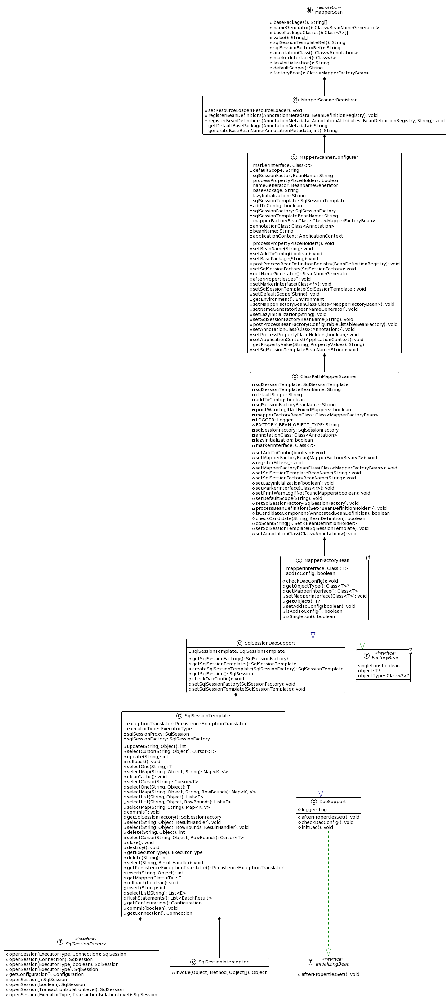

# 说明

[mybatis-spring 使用教程](https://mybatis.org/spring/zh/getting-started.html)

[对应的源码](https://github.com/haitaoss/mybatis-spring)

Mybatis整合Spring的好处：

1. 对接了Spring事务，保证同一个Spring事务，使用同一个SqlSession
2. 在不同的Spring事务，都会new一个新的SqlSession
3. 不在Spring事务下，每执行完Mybatis的一个方法（insert、update、select、delete）就提交事务

注：发现一个性能优化的点，在不开启事务的情况下，在一个方法内重复执行 Mapper 的方法，会反复的创建SqlSession，这个时候，可以使用`@Transactional(propagation = Propagation.NOT_SUPPORTED)` ，既能保证非事物情况下运行，也能保证在方法中只创建一个SqlSession。

```java
@Service
@Slf4j
public class UserService extends ServiceImpl<UserMapper, User> {
    public Consumer<String> run = taskDesc -> {
        long start = System.currentTimeMillis();
        for (int i = 0; i < 100; i++) {
            baseMapper.selectList(null);
        }
        long time = System.currentTimeMillis() - start;
        System.out.println(String.format("%s 耗时: %s ms", taskDesc, time));
    };

    public void test() {
        run.accept("不使用事务的情况"); // 执行100次，需要 300ms
    }

    @Transactional(propagation = Propagation.NOT_SUPPORTED)
    //    @Transactional
    public void test_transaction() {
        run.accept("使用事务的情况"); // 执行100次，需要 8ms
    }

}
```

# 类图

> MapperScan 会导入 MapperScannerRegistrar
>
> MapperScannerRegistrar 会注册 MapperScannerConfigurer
>
> MapperScannerConfigurer 会实例化 ClassPathMapperScanner
>
> 使用 ClassPathMapperScanner 注册 MapperFactoryBean
>
> MapperFactoryBean 继承 SqlSessionDaoSupport 
>
> SqlSessionDaoSupport 会通过依赖注入 SqlSessionTemplate,或者注入 SqlSessionFactory 在通过 SqlSessionFactory 构造出 SqlSessionTemplate，总之最终是使用 SqlSessionTemplate。
>
> MapperFactoryBean 实现了 InitializingBean，初始化的代码逻辑就是，将Mapper.java注册到Mybatis的Configuration对象的
>
> MapperFactoryBean 实现了 FactoryBean，所以IOC容器中可以拿到其 `MapperFactoryBean.getObject()` 返回的对象，`getObject`的逻辑是`	Configuration.getMapper(type, SqlSessionTemplate);` 也就是使用的SqlSession是 SqlSessionTemplate，而SqlSessionTemplate又委托给其内部属性`sqlSessionProxy`。
>
> `sqlSessionProxy`是使用JDK代理创建 SqlSession 接口的代理对象，这个代理对象就是用来执行Mybatis的API的，其增强逻辑是 SqlSessionInterceptor。
>
> [SqlSessionInterceptor 具体的增强逻辑](#说明)



# 使用 @MapperScan 会发生什么？

```java
/**
 * 使用 @MapperScan 会发生什么？
 *
 * @MapperScan 注解上标注了 @Import(MapperScannerRegistrar.class)，也就是说 Spring 在解析配置类时，会导入 MapperScannerRegistrar 这个bean
 * 而 MapperScannerRegistrar 实现了 ImportBeanDefinitionRegistrar 接口，所以其 {@link MapperScannerRegistrar#registerBeanDefinitions(AnnotationMetadata, BeanDefinitionRegistry)}
 * 会被回调，回调的参数有 BeanDefinitionRegistry ，使用 BeanDefinitionRegistry 就可以动态的注册 BeanDefinition
 *
 *
 * 具体回调方法的逻辑
 * {@link MapperScannerRegistrar#registerBeanDefinitions(AnnotationMetadata, BeanDefinitionRegistry)}
 *      1. 拿到 @MapperScan 的信息
 *          AnnotationAttributes mapperScanAttrs = AnnotationAttributes.fromMap(importingClassMetadata.getAnnotationAttributes(MapperScan.class.getName()));
 *
 *      2. 构造 BeanDefinition。并将 mapperScanAttrs注解的属性信息 设置进去
 *          BeanDefinitionBuilder builder = BeanDefinitionBuilder.genericBeanDefinition(MapperScannerConfigurer.class);
 *          builder.addPropertyValue("annotationClass", annotationClass);
 *          ...
 *
 *      3. 注册 BeanDefinition 到 BeanFactory 中
 *          registry.registerBeanDefinition(beanName, builder.getBeanDefinition());
 * 
 * Tips：所以重点还得看 MapperScannerConfigurer 做了啥
 * */
```

# 使用 @MapperScans 会发生什么？

```java
/**
 * @使用 @MapperScans 会发生什么？
 *
 * @MapperScans 注解上标注了 @Import(MapperScannerRegistrar.RepeatingRegistrar.class)，也就是说 Spring 在解析配置类时，会导入 RepeatingRegistrar 这个bean
 * 而 RepeatingRegistrar 继承了 MapperScannerRegistrar ，然后 MapperScannerRegistrar 实现了ImportBeanDefinitionRegistrar 接口，所以其 {@link MapperScannerRegistrar#registerBeanDefinitions(AnnotationMetadata, BeanDefinitionRegistry)}
 * 会被回调，回调的参数有 BeanDefinitionRegistry ，使用 BeanDefinitionRegistry 就可以动态的注册 BeanDefinition
 *
 * 具体逻辑和 @MapperScan 的是差不多的，多了一步 遍历 @MapperScans 注解值，按照 @MapperScan的方式处理
 * */
```

[@MapperScan的逻辑](#使用 @MapperScan 会发生什么？)

# MapperScannerConfigurer

```java
/**
 *
 * MapperScannerConfigurer 实现了 BeanDefinitionRegistryPostProcessor , 属于BeanFactory的后置处理器
 * 所以在 {@link AbstractApplicationContext#invokeBeanFactoryPostProcessors(ConfigurableListableBeanFactory)} 会回调方法
 * {@link MapperScannerConfigurer#postProcessBeanDefinitionRegistry(BeanDefinitionRegistry)}
 *
 * MapperScannerConfigurer 的主要作用是根据 包路径，递归扫描包下的所有接口，将每个接口解析成BeanDefinition。并注册到BeanFactory中，
 * 而BeanDefinition设置的beanClass 默认是这个 MapperFactoryBean，并且设置 当前类 作为其 构造器参数
 *
 *      definition.setBeanClass(MapperFactoryBean.class);
 *      definition.getConstructorArgumentValues().addGenericArgumentValue(beanClassName);
 * */
```

## MapperScannerConfigurer#postProcessBeanDefinitionRegistry

```java
/**
 *
 * {@link MapperScannerConfigurer#postProcessBeanDefinitionRegistry(BeanDefinitionRegistry)}
 *
 *  1. 实例化一个 ClassPathMapperScanner。
 *      ClassPathMapperScanner scanner = new ClassPathMapperScanner(registry);
 *
 *      注：ClassPathMapperScanner 是用来递归扫描包下的类，扫描的结果会回调 isCandidateComponent 方法进行判断，满足了，
 *      才进行 excludeFilter + includeFilter + condition 的判断，判断通过 就构造出 BeanDefinition 并注册到BeanFactory中
 *
 *      {@link ClassPathMapperScanner#isCandidateComponent(AnnotatedBeanDefinition)}
 *          逻辑很简单：是接口才是true
 *
 *
 * 2. 根据 @MapperScan 的值给 scanner 设置 IncludeFilter
 *      比如 @MapperScan(annotationClass = Component.class, markerInterface = A.class)
 *                      AnnotationTypeFilter                AssignableTypeFilter
 *                      判断有 @Component 才是true            判断类型属于 A.class 的才是true
 *      但是 @MapperScan 的默认值，是不会设置的。默认值的判断看这里
 *      {@link MapperScannerRegistrar#registerBeanDefinitions(AnnotationMetadata, AnnotationAttributes, BeanDefinitionRegistry, String)}
 *
 * 3. 将扫描得到的 BeanDefinition 进行二次处理
 *      {@link ClassPathMapperScanner#doScan(String...)}
 *      {@link ClassPathMapperScanner#processBeanDefinitions(Set)}
 *      // 最主要的是设置了 beanClass 和 构造器参数
 *      definition.setBeanClass(MapperFactoryBean.class);
 *      definition.getConstructorArgumentValues().addGenericArgumentValue(beanClassName);
 *
 * Tips：所以具体是怎么管理上 Mybaits 的 还得看 MapperFactoryBean
 *
 * */
```

# MapperFactoryBean

```java
/**
 * {@link org.mybatis.spring.mapper.MapperFactoryBean}
 *  MapperFactoryBean 实现了 FactoryBean 继承 SqlSessionDaoSupport
 *
 *  作为 FactoryBean 的作用
 *  {@link MapperFactoryBean#getObject()}
 *      就是通过 SqlSession得到接口的代理对象
 *      return getSqlSession().getMapper(this.mapperInterface);
 *
 * SqlSessionDaoSupport
 * 间接实现了 InitializingBean ，其 afterPropertiesSet 的逻辑是执行两个方法
 *      this.checkDaoConfig(); // 属于抽象方法，需要子类实现
 *      this.initDao(); // 预留的方法，空实现
 *
 *      还会通过依赖注入：SqlSessionTemplate 和 SqlSessionFactory。 SqlSessionTemplate 是 SqlSessionFactory 的一个装饰类，对外是使用的 SqlSessionTemplate。
 *      SqlSessionTemplate 实现了 SqlSession，对外使用 SqlSessionTemplate 是因为，
 *      关于 SqlSession 接口方法的实现 是通过 SqlSessionInterceptor 拦截，拦截的增强逻辑看
 *      {@link SqlSessionTemplate.SqlSessionInterceptor#invoke(Object, Method, Object[])}
 * 
 *		注：设置了 definition.setAutowireMode(AbstractBeanDefinition.AUTOWIRE_BY_TYPE); 所以没写@Autowired注解，也会进行依赖注入
 *
 *
 * checkDaoConfig 的逻辑就是将接口注册到 Mybatis的 Configuration 对象中
 * {@link MapperFactoryBean#checkDaoConfig()}
 *      Configuration configuration = getSqlSession().getConfiguration();
 *      configuration.addMapper(this.mapperInterface);
 * */
```

## SqlSessionInterceptor#invoke

```java
/**
 * SqlSession代理类的增强逻辑
 *
 * {@link SqlSessionTemplate.SqlSessionInterceptor#invoke(Object, Method, Object[])}
 *
 * 1. 拿到 SqlSession
 *      SqlSession sqlSession = getSqlSession(SqlSessionTemplate.this.sqlSessionFactory,
 *                     SqlSessionTemplate.this.executorType, SqlSessionTemplate.this.exceptionTranslator);
 *
 *      注：这里对接了Spring的事物。getSqlSession的逻辑是，通过sqlSessionFactory作为key，从Spring事务资源中获取sqlSession，
 *         获取不到就new一个 `sessionFactory.openSession(executorType);`
 *         然后若当前线程在事务方法中，那么就将 new出来的sqlSession 存到Spring事务资源中，从而保证在一个Spring事务中，多次执行
 *         Mybatis的 MappedStatement(sql) 是同一个sqlSession
 *
 * 2. 使用拿到的 SqlSession 反射调用方法
 *       Object result = method.invoke(sqlSession, args);
 *       等价于：DefaultSqlSession.selectOne("id")
 *
 * 3. 判断是否需要提交事务。
 *      在 Spring的 TransactionSynchronizationManager(事物同步管理器)中 没有记录当前这个 sqlSession，那就直接提交
 *      sqlSession.commit(true);
 *
 * 4. 判断是否需要关闭SqlSession
 *      在 Spring的 TransactionSynchronizationManager(事物同步管理器)中  才要关闭 sqlSession
 *      closeSqlSession(sqlSession, SqlSessionTemplate.this.sqlSessionFactory);
 *
 *
 * Tips：Mybatis 整合 Spring，最重要的就是这个增强逻辑。一个SqlSession执行完方法，若当前线程没有在事务方法中，就提交并close，从而保证
 *       每个Sql的执行是不同事务的，因为都是新new的SqlSession。
 * */
```